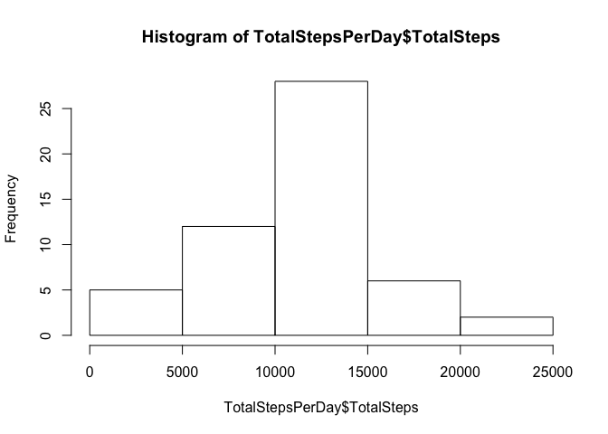
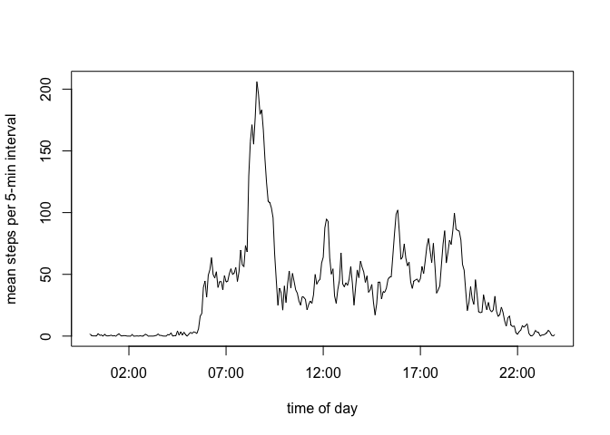
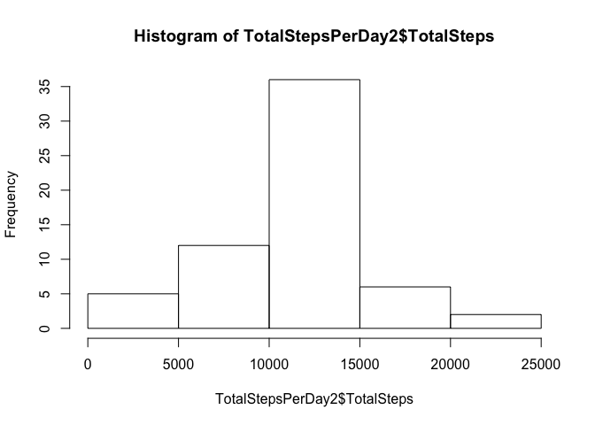
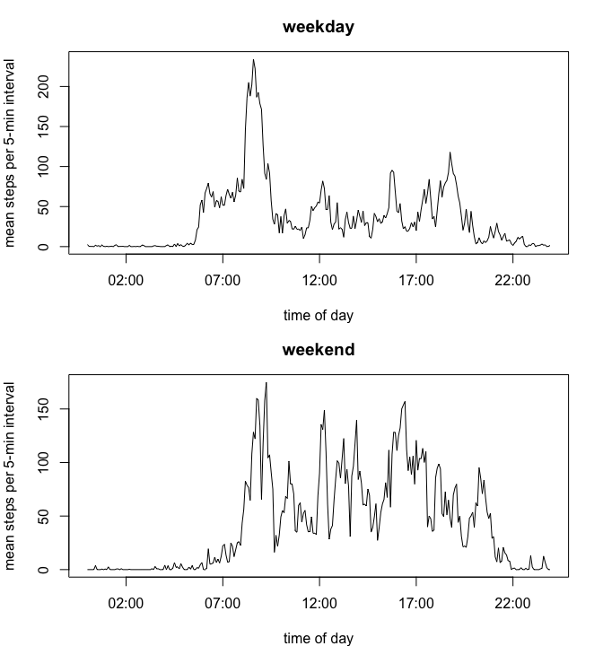

## Introduction

It is now possible to collect a large amount of data about personal movement using activity monitoring devices such as a Fitbit, Nike Fuelband, or Jawbone Up. These type of devices are part of the “quantified self” movement – a group of enthusiasts who take measurements about themselves regularly to improve their health, to find patterns in their behavior, or because they are tech geeks. But these data remain under-utilized both because the raw data are hard to obtain and there is a lack of statistical methods and software for processing and interpreting the data.

This assignment makes use of data from a personal activity monitoring device. This device collects data at 5 minute intervals through out the day. The data consists of two months of data from an anonymous individual collected during the months of October and November, 2012 and include the number of steps taken in 5 minute intervals each day.

The data for this assignment was downloaded from the course web site:
<https://d396qusza40orc.cloudfront.net/repdata%2Fdata%2Factivity.zip>

## Loading and preprocessing the data

First we will read the data into R, into a table called `data`, and we process the `date` and `interval` character fields into R-friendly formats.


```r
library(dplyr)
data <- read.csv("activity.csv", 
                 colClasses = c('numeric', 'character', 'numeric'))
data$date <- as.Date(data$date, '%Y-%m-%d')
data$timeofday <- data$interval %/% 100 * 60 * 60 + data$interval %% 100 * 60
```


## What is mean total number of steps taken per day?

Next we calculate the mean total number of steps taken per day and plot a histogram, ignoring missing values. 


```r
TotalStepsPerDay <- data %>% group_by(date) %>% summarize(TotalSteps=sum(steps))
hist(TotalStepsPerDay$TotalSteps)
```

<!-- -->

```r
mean(TotalStepsPerDay$TotalSteps, na.rm=TRUE)
```

```
## [1] 10766.19
```

```r
median(TotalStepsPerDay$TotalSteps, na.rm=TRUE)
```

```
## [1] 10765
```

The mean and median of these calculations are 1.0766189\times 10^{4} and 1.0765\times 10^{4}, respectively.

## What is the average daily activity pattern?

Here we calculate the mean steps for each 5-minute interval, averaged across all the days recorded. This is then plotted in a "time series". The interval with the highest mean steps is 8:35. 


```r
AveDailyActivity <- data %>% group_by(interval) %>% 
   summarize(MeanSteps = mean(steps, na.rm=TRUE))
AveDailyActivity$timeofday <- strptime(paste(AveDailyActivity$interval %/% 100,
                                             AveDailyActivity$interval %% 100), 
                                       "%H %M")
plot(AveDailyActivity$timeofday, AveDailyActivity$MeanSteps, 
     type="l", xlab="time of day", ylab="mean steps per 5-min interval")
```

<!-- -->

```r
AveDailyActivity$interval[which.max(AveDailyActivity$MeanSteps)]
```

```
## [1] 835
```


## Imputing missing values

We find that there are `sum(is.na(data$steps))` missing values. We deal with these by creating a new data table, `data2`, in which we impute the number of steps by using the mean for that 5-minute interval. We again calculate the total steps taken per day with the newly imputed information, output a histogram of this data, and re-calculate mean and median. 


```r
sum(is.na(data$steps))
```

```
## [1] 2304
```

```r
RowsToImpute <- is.na(data$steps)
IntervalsToImpute <- data$interval[is.na(data$steps)]
data2 <- data
data2$imputedsteps <- data2$steps
data2$imputedsteps[RowsToImpute] <-
   AveDailyActivity$MeanSteps[match(IntervalsToImpute, AveDailyActivity$interval)]
TotalStepsPerDay2 <- data2 %>% group_by(date) %>%
   summarize(TotalSteps=sum(imputedsteps))
hist(TotalStepsPerDay2$TotalSteps)
```

<!-- -->

```r
mean(TotalStepsPerDay2$TotalSteps, na.rm=TRUE)
```

```
## [1] 10766.19
```

```r
median(TotalStepsPerDay2$TotalSteps, na.rm=TRUE)
```

```
## [1] 10766.19
```


## Are there differences in activity patterns between weekdays and weekends?

Lastly we plot the mean steps per 5-minute interval for weekdays separate from weekends. 


```r
data2$weekday <- factor(weekdays(data2$date) %in% c("Saturday", "Sunday"), labels=c("weekday", "weekend"))

AveDailyActivity2 <- data2 %>% group_by(interval, weekday) %>%
   summarize(MeanSteps=mean(steps, na.rm=TRUE))
AveDailyActivity2$timeofday <- with(AveDailyActivity2, 
                                    strptime(paste(interval %/% 100, 
                                                   interval %% 100),
                                             "%H %M")) 

par(mfrow=c(2,1), mar=c(4,4,3,2))
plot(AveDailyActivity2$timeofday[AveDailyActivity2$weekday=="weekday"],
     AveDailyActivity2$MeanSteps[AveDailyActivity2$weekday=="weekday"], 
     type="l", main='weekday', 
     xlab="time of day", ylab="mean steps per 5-min interval")
plot(AveDailyActivity2$timeofday[AveDailyActivity2$weekday=="weekend"],
     AveDailyActivity2$MeanSteps[AveDailyActivity2$weekday=="weekend"], 
     type="l", xlab="time of day", ylab="mean steps per 5-min interval",
     main='weekend')
```

<!-- -->

